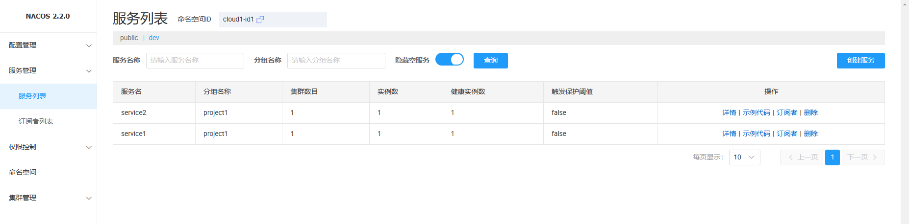

## cloud 项目学习
### 版本描述
nacos：2.2.0
spring-cloud-alibaba： 2021.0.4.0
spring-boot：2.7.5
spring-cloud：2021.0.4

### 注册中心nacos的使用
1. nacos启动 <br/>
    修改conf文件加下的application.properties配置文件中的server.port=8848可以修改启动端口 <br/>
    启动命令：单机模式启动 进入nacos的bin目录 以单机模式启动 <br/>
    Linux: sh startup.sh -m standalone <br/>
    Windows: startup.cmd -m standalone
2. cloud项目配置文件  bootstrap.yaml
```yaml
spring:
  application:
    # 微服务中单个访问的名字
    name: service1
  cloud:
    nacos:
      discovery:
        # nacos服务注册中心的地址
        server-addr: 192.168.235.40:8848
        # 命名空间ID 工具命名空间进行隔离
        namespace: cloud1-id1
        # 服务分组
        group: project1
      config:
        # nacos 服务配置中心地址
        server-addr: 192.168.235.40:8848
        # 配置文件扩展名
        file-extension: yaml
        namespace: cloud1-id1
        group: project1
```

3. 启动类上添加 @EnableDiscoveryClient 注解，启用注册发现中心
```java
// 配置中心配置文件属性注入需要的注解，使@Value可以注入配置中心的属性
@RefreshScope
@RestController
@SpringBootApplication
// 服务注册发现客户端，启用服务注册与发现
@EnableDiscoveryClient
// feign注解，启用服务调用
@EnableFeignClients
public class S1Application {
	
	public static void main(String[] args) {
		SpringApplication.run(S1Application.class, args);
	}
	@Value("${config.info}")
	private String info;
	
	@Value("${config.yyz}")
	private String yyz;
	@Value("${server.port}")
	private String port;
}
```

4. 启动服务后，可以在nacos管理页面中的服务管理 >> 服务列表中看到上线的服务


使用配置中心时，如果没有bootstrap.yaml文件，无法拉取监听到配置中心的数据

### spring cloud gateway 网关
依赖：
```xml
    <dependencies>
        <dependency>
            <groupId>org.springframework.cloud</groupId>
            <artifactId>spring-cloud-starter-gateway</artifactId>
        </dependency>
    </dependencies>
```
配置文件：
```yaml
server:
  port: 7520

spring:
  main:
    # 程序启动方式
    web-application-type: reactive
  application:
    name: gateway
  cloud:
    nacos:
      discovery:
        # 服务注册发现中心地址
        server-addr: 192.168.235.40:8848
        namespace: cloud1-id1
        group: project1
    # 网关配置
    gateway:
      routes:
        - id: route1
          uri: lb://service1
          order: 1
          predicates:
            - Path=/service1/**
          filters:
            - StripPrefix=1
```

断言（Predicate）：参照 Java8 的新特性Predicate，允许开发人员匹配 HTTP 请求中的任何内容，比如请求头或请求参数，最后根据匹配结果返回一个布尔值。
路由（route）：由ID、目标URI、断言集合和过滤器集合组成。如果聚合断言结果为真，则转发到该路由。
过滤器（filter）：可以在返回请求之前或之后修改请求和响应的内容。