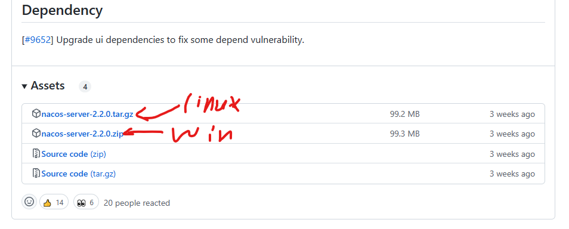
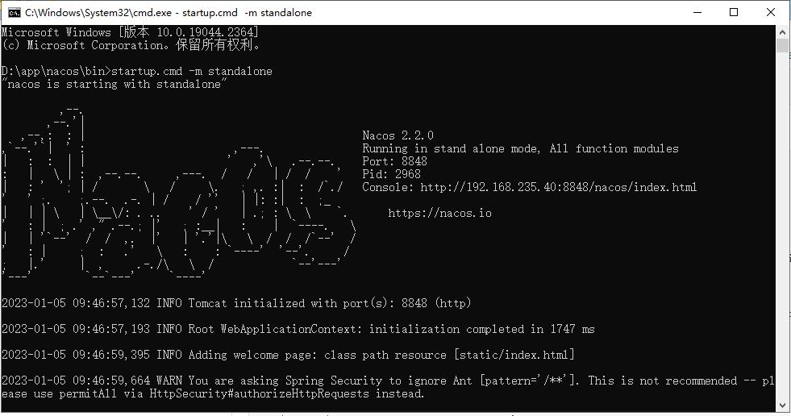
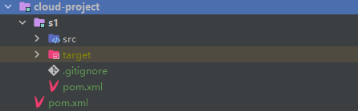
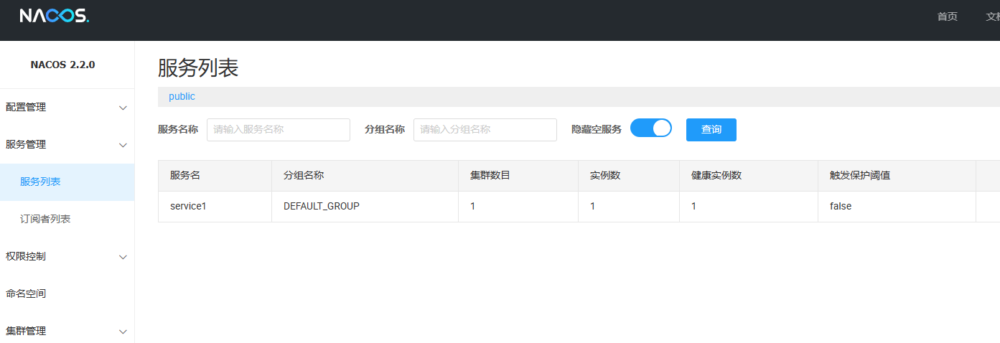

## spring cloud alibaba 笔记


### 注册中心

1. 使用nacos作为注册中心；
2. 下载nacos server：[Releases · alibaba/nacos (github.com)](https://github.com/alibaba/nacos/releases)

   
3. 启动nacos server

下载后解压，进入到bin目录中打开cmd，以单机方式运行服务

启动命令：startup.cmd -m standalone



将 Console后面的地址复制到浏览器打开，用户名密码默认都是nacos

4. 创建客户端，即创建spring cloud项目

a. 创建一个空的maven项目作为父项目，将打包方式改维pom，然后在父项目中添加如下依赖管理

```xml
    <dependencyManagement>
        <dependencies>
            <dependency>
                <groupId>com.alibaba.cloud</groupId>
                <artifactId>spring-cloud-alibaba-dependencies</artifactId>
                <version>2021.0.4.0</version>
                <type>pom</type>
                <scope>import</scope>
            </dependency>

            <dependency>
                <groupId>org.springframework.boot</groupId>
                <artifactId>spring-boot-dependencies</artifactId>
                <version>2.7.5</version>
                <type>pom</type>
                <scope>import</scope>
            </dependency>

            <dependency>
                <groupId>org.springframework.cloud</groupId>
                <artifactId>spring-cloud-dependencies</artifactId>
                <version>2021.0.4</version>
                <type>pom</type>
                <scope>import</scope>
            </dependency>
        </dependencies>
    </dependencyManagement>
```

b. 在该项目下新建模块，选择maven项目，该maven项目就是一个服务

引入web依赖和注册中心依赖，如下

```xml
    <dependencies>
        <dependency>
            <groupId>org.springframework.boot</groupId>
            <artifactId>spring-boot-starter-web</artifactId>
        </dependency>

        <dependency>
            <groupId>com.alibaba.cloud</groupId>
            <artifactId>spring-cloud-starter-alibaba-nacos-discovery</artifactId>
        </dependency>
    </dependencies>
```

项目结构如下图：



c. 在配置文件中配置注册中心相关信息，yaml文件如下

```yaml
server:
  port: 2333

spring:
  application:
    name: service1
  cloud:
    nacos:
      discovery:
        server-addr: 192.168.235.40:8848
```

name是当前这服务的名字，server-addr是注册中心的地址

d. 在spring boot启动类上添加启用注册中心的注解：@EnableDiscoveryClient

代码如下：

```java
@SpringBootApplication
@EnableDiscoveryClient
public class S1Application {

	public static void main(String[] args) {
		SpringApplication.run(S1Application.class, args);
	}
}
```

启动该项目，可以在注册中心看到已经将该服务注册到注册中心了



### 配置中心

1. 使用配置中心需要添加配置中心相关依赖、如下
